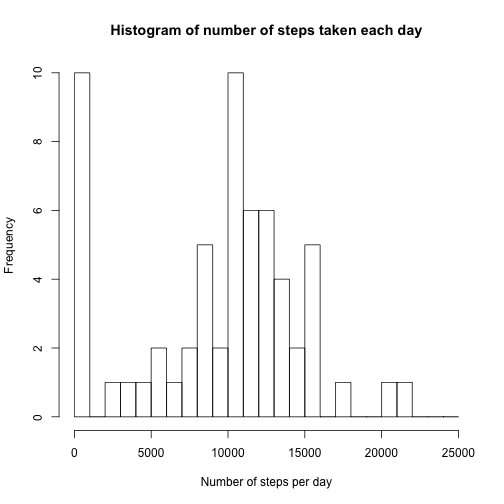
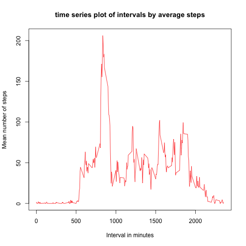
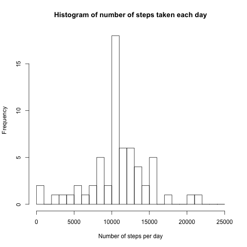

## Loading and preprocessing the data

Load Data

```r
 data <- read.csv("activity.csv", na.strings = "NA")
```


## What is mean total number of steps taken per day?

1. Calculate the total number of steps taken per day
 

```r
stepsbydate <- aggregate(data$steps, by=list(data$date), FUN=sum, na.rm=TRUE)
```

2. Histogram of the total number of steps taken each day


```r
hist(stepsbydate$x, breaks = seq(from = 0, to = 25000, by= 1000),xlab = "Number of steps per day",main="Histogram of number of steps taken each day")
```

 

3. Calculate the mean and median


```r
mean(stepsbydate$x)
```

```
## [1] 9354.23
```

```r
median(stepsbydate$x)
```

```
## [1] 10395
```
## What is the average daily activity pattern?

1. Time Series plot of the 5 minute interval and the average number of steps

calculate average number of steps by interval

```r
meanstepsbyinterval <- aggregate(data$steps, by = list(data$interval), FUN=mean, na.rm = TRUE)
```

Create the Time series plot

```r
plot(meanstepsbyinterval$Group.1, 
     meanstepsbyinterval$x, 
     type="l", 
     col="red", 
     xlab="Interval in minutes", 
     ylab="Mean number of steps", 
     main="time series plot of intervals by average steps")
```

 

2. Which 5-minute interval, on average across all the days in the dataset, contains the maximum number of steps?


```r
meanstepsbyinterval[meanstepsbyinterval$x == max(meanstepsbyinterval$x),]$Group.1
```

```
## [1] 835
```

## Imputing missing values

1. calculate and report the number of missin values int he dataset


```r
sum(is.na(data$steps))
```

```
## [1] 2304
```

2. Devise a strategy for filling in all the missing values in the dataset.

Will fill the NAs with the mean for the 5 minute interval (already calculated in meanstepsbyinterval)


```r
#rename columns to merge
names(meanstepsbyinterval) <- c("interval","mean")

#merge data
mergeddata <- merge(data, meanstepsbyinterval, by = "interval", suffixes = c("d","m"))

#create na filter
na_filter <- is.na(mergeddata$steps)

#replace NA's with the corresponding mean
mergeddata$steps[na_filter] <- mergeddata$mean[na_filter]
```

3. Create a new dataset

```r
# create the new imputed dataset with the original columns
Imputed_data <- mergeddata[,c(1:3)]
```

4. Histogram, Means , and Median
Calculate the total number of steps taken per day

recalculate steps per day

```r
stepsbydate2 <- aggregate(Imputed_data$steps, by=list(Imputed_data$date), FUN=sum, na.rm=TRUE)
```

recreate histogram

```r
hist(stepsbydate2$x, breaks = seq(from = 0, to = 25000, by= 1000),xlab = "Number of steps per day",main="Histogram of number of steps taken each day")
```

 

recalculate the mean and median

```r
mean(stepsbydate2$x)
```

```
## [1] 10766.19
```

```r
median(stepsbydate2$x)
```

```
## [1] 10766.19
```

Filling the holes in the dataset have pushed up the mean and median. Also, the mean and median are now the same value.

## Are there differences in activity patterns between weekdays and weekends?

1. Create a new factor variable in the dataset with two levels – “weekday” and “weekend” indicating whether a given date is a weekday or weekend day


```r
weekdata <- data
#convert date to POSIX
weekdata$date <- as.POSIXct(weekdata$date, format="%Y-%m-%d")
# add the weekday field
weekdata <- cbind(weekdata, weekday = weekdays(weekdata$date))
#add daytype field
weekdata <- cbind(weekdata, daytype = ifelse(weekdata$weekday == "Saturday" | weekdata$weekday == "Sunday", "weekend", "weekday"))
#convert to factor
weekdata$daytype <- as.factor(weekdata$daytype)
```

2. Make a panel plot containing a time series plot (i.e. type = "l") of the 5-minute interval (x-axis) and the average number of steps taken, averaged across all weekday days or weekend days (y-axis).


```r
# Load the lattice graphical library
library(lattice)

# Compute the average number of steps taken, averaged across all daytype variable
meanweekdata <- aggregate(weekdata$steps, 
                       by=list(weekdata$daytype, 
   weekdata$interval), mean, na.rm=TRUE)

# Rename the attributes
names(meanweekdata) <- c("daytype", "interval", "mean")

# panelplotknit
xyplot(mean ~ interval | daytype, meanweekdata, 
       type="l", 
       lwd=1, 
       xlab="Interval", 
       ylab="Number of steps", 
       layout=c(1,2))
```

 
